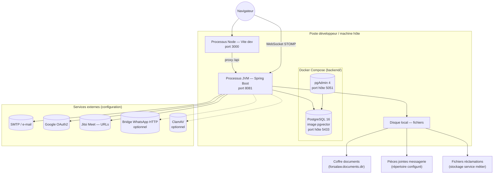
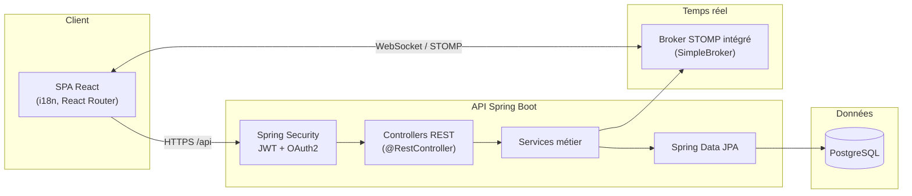

<div align="center">

# ForsaLaw

**Plateforme LegalTech tunisienne** — mise en relation client-avocat, rendez-vous (présentiel / en ligne), notifications, authentification sécurisée et modules de collaboration.

[](https://openjdk.org/)
[](https://spring.io/projects/spring-boot)
[](https://react.dev/)
[](https://www.postgresql.org/)

</div>

---

## Vue d'ensemble

> [!NOTE]
> ForsaLaw regroupe dans une même application la **gestion des comptes** (client, avocat, admin), la **prise de rendez-vous** avec agenda avancé côté avocat, les **notifications e-mail**, la **visioconférence** pour les RDV en ligne (liens Jitsi), la **sécurité** (JWT, OAuth2 Google, réinitialisation de mot de passe), ainsi que la **messagerie**, les **réclamations**, le **coffre-fort documents** et d’autres modules métier exposés en **API REST** et documentés via **Swagger**.


---

## Architecture physique

> [!IMPORTANT]
> Schéma aligné sur ce dépôt : **développement local** (ports et chemins issus de `application.properties`, `vite.config.js` et `backend/docker-compose.yml`).



**Composants physiques concrets**

| Élément | Rôle |
|--------|------|
| **PostgreSQL** (conteneur `pgvector/pgvector:pg16`) | Base relationnelle + extension **pgvector** pour le futur / optionnel RAG (`legal_document_chunk`, migration SQL `V1` dans le dépôt). |
| **pgAdmin** | Administration de la base (développement). |
| **Spring Boot** | API unique, Tomcat embarqué, port **8081** par défaut. |
| **Vite + React** | SPA en dev sur **3000**, proxy `/api` → `8081`. |
| **Volumes Docker** | Persistance des données PostgreSQL (`forsalaw_pgdata`). |
| **Système de fichiers** | Stockage des documents coffre-fort, PJ messagerie, PJ réclamations (chemins paramétrables). |

---

## Architecture logique

> [!IMPORTANT]
> Découpage **réel** du backend : packages `com.forsalaw.*` et flux HTTP / données ci-dessous.



**Modules métier (packages Java)**

| Package | Responsabilité |
|---------|----------------|
| `userManagement` | Utilisateurs, auth JWT, OAuth2, profils, photo de profil liée au coffre. |
| `avocatManagement` | Profil avocat, vérification, exposition publique / espace connecté. |
| `affaireManagement` | Dossiers / affaires et statuts. |
| `rdvManagement` | Rendez-vous, agenda avocat, créneaux, rappels. |
| `messengerManagement` | Conversations, messages, pièces jointes, **WebSocket** (`realtime/`). |
| `reclamationManagement` | Réclamations, pièces jointes, transitions de statut. |
| `documentManagement` | Coffre-fort, métadonnées, logs d’accès, signature PDF. |
| `notificationManagement` | E-mails et pont WhatsApp (selon configuration). |
| `forumManagement` | Forum (sujets / messages). |
| `avisAvocatManagement` | Avis sur les avocats. |
| `auditManagement` | Journalisation d’audit. |
| `security` | Filtres JWT, configuration d’accès. |
| `config` | Configuration transverse (ex. SpringDoc / OpenAPI). |
| `documentManagement.config` | Beans techniques liés au module documents (ex. correctif contrainte PostgreSQL au démarrage). |
| `util` | Utilitaires partagés (ex. hachage). |

**Persistance et schéma**

- **JPA / Hibernate** avec `spring.jpa.hibernate.ddl-auto=update` pour faire évoluer le schéma à partir des entités.
- **Flyway** présent dans les dépendances mais **désactivé par défaut** ; le dépôt contient une migration **RAG** (`db/migration/V1__...`) à appliquer manuellement ou en activant Flyway ponctuellement (voir `docs/FLYWAY-VS-JPA.md`).

---

## Stack technique

> [!NOTE]
> Badges indicatifs ; versions précises dans `pom.xml` et `package.json`.


---

## Structure du dépôt

> [!TIP]
> - `backend/` — API Spring Boot, logique métier, persistance, `docker-compose.yml` (PostgreSQL + pgAdmin).
> - `frontend/` — Application React (Vite), proxy `/api` vers le backend en développement.
> - `docs/` — Guides techniques et workflows.
> - `.github/workflows/` — Pipelines CI.

---

## Démarrage rapide


### 1. Cloner le dépôt

```bash
git clone https://github.com/ForsaLaw/ForsaLaw.git
cd ForsaLaw
```

### 2. Démarrer la base de données (PostgreSQL via Docker)

Depuis le dossier **`backend/`** :

```bash
cd backend
docker-compose up -d
```

**Ce que fait cette commande :**

- télécharge l’image **PostgreSQL 16** avec extension **pgvector** si nécessaire (`pgvector/pgvector:pg16`) ;
- crée et démarre le conteneur **`forsalaw-postgres`** ;
- mappe le port **5433** sur l’hôte vers **5432** dans le conteneur ;
- démarre aussi **pgAdmin** (`forsalaw-pgadmin`, port hôte **5051**) ;
- exécute les services en arrière-plan (`-d`).

**Vérifier que tout tourne :**

```bash
docker ps
```

Tu dois voir au minimum **`forsalaw-postgres`** (et **`forsalaw-pgadmin`** si tu n’as pas limité les services).

### 3. Variables d’environnement

Copier **`backend/.env.example`** vers **`.env`** (toujours dans `backend/`) et renseigner les valeurs nécessaires, par exemple :

- `DB_URL`, `DB_USERNAME`, `DB_PASSWORD` (alignés sur `docker-compose.yml` en local : `jdbc:postgresql://localhost:5433/forsalaw`, `forsalaw` / `forsalaw`) ;
- `JWT_SECRET` ;
- `GOOGLE_CLIENT_ID`, `GOOGLE_CLIENT_SECRET` (OAuth2) ;
- `MAIL_*`, `MAIL_FROM` si tu veux de vrais e-mails ;
- `ADMIN_SUPPORT_EMAIL`, `JITSI_BASE_URL`, etc.

### 4. Compiler le backend (Maven)

Toujours depuis **`backend/`** :

```bash
mvn clean install -DskipTests
```

*(Tu peux retirer `-DskipTests` si tu veux lancer les tests à la compilation.)*

### 5. Lancer l’API Spring Boot

```bash
mvn spring-boot:run
```

L’API écoute par défaut sur le port **8081** (`SERVER_PORT` dans `.env` pour changer).

### 6. Lancer le frontend (Vite + React)

Dans un **second terminal**, depuis la racine du dépôt puis **`frontend/`** :

```bash
cd frontend
npm install
npm run dev
```

Le serveur de dev Vite utilise le port **3000** et **proxy** les appels `/api` vers `http://localhost:8081`.

### 7. Vérifier que tout fonctionne

Ouvre un navigateur :

- **Swagger UI :** [http://localhost:8081/swagger-ui.html](http://localhost:8081/swagger-ui.html)  
  *(équivalent souvent disponible : `/swagger-ui/index.html`)*  
- **Frontend :** [http://localhost:3000](http://localhost:3000)

---


```bash
# Compiler le backend
cd backend && mvn clean install -DskipTests

# Lancer l’API
cd backend && mvn spring-boot:run

# Démarrer PostgreSQL (+ pgAdmin) en arrière-plan
cd backend && docker-compose up -d

# Arrêter les conteneurs
cd backend && docker-compose down

# Suivre les logs PostgreSQL
cd backend && docker-compose logs -f postgres

# Conteneurs en cours d’exécution
docker ps
```

---


| Ressource | URL |
|-----------|-----|
| **API (backend)** | [http://localhost:8081](http://localhost:8081) |
| **Swagger UI** | [http://localhost:8081/swagger-ui.html](http://localhost:8081/swagger-ui.html) |
| **OpenAPI (JSON)** | [http://localhost:8081/v3/api-docs](http://localhost:8081/v3/api-docs) |
| **Frontend (Vite)** | [http://localhost:3000](http://localhost:3000) |
| **pgAdmin** | [http://localhost:5051](http://localhost:5051) *(identifiants par défaut dans `backend/docker-compose.yml`)* |

---


**Nadhmi** et **Youssef** n’acceptent les fusions (merge requests / pull requests) que si le job de build CI est **vert** et que le code **ne dégrade** pas la qualité ni les performances du projet ForsaLaw.

---

## Workflow Git

> [!NOTE]
> Branche de travail cible : **`develop`**.
>
> 1. Mettre à jour `develop`  
> 2. Créer une branche `feature/...` ou `fix/...`  
> 3. Commits explicites  
> 4. Push et PR vers `develop`  
> 5. Fusion après revue et CI verte  
>
> Détails : [docs/GIT-WORKFLOW.md](docs/GIT-WORKFLOW.md), [docs/DEVOPS.md](docs/DEVOPS.md)

---

## Documentation interne

> [!NOTE]
> - [docs/DOCKER.md](docs/DOCKER.md)  
> - [docs/FLYWAY-VS-JPA.md](docs/FLYWAY-VS-JPA.md)  
> - [docs/RAG-INTEGRATION-NON-ENDPOINTS.md](docs/RAG-INTEGRATION-NON-ENDPOINTS.md)  
> - [docs/Liste_Des_Endpoints_USER_AVOCAT_AUTHENTIFIACTION.md](docs/Liste_Des_Endpoints_USER_AVOCAT_AUTHENTIFIACTION.md)

---

## Ressources

> [!TIP]
> - [Feuille Google Sheets ForsaLaw](https://docs.google.com/spreadsheets/d/1SuGkhR0qkSWrvWlVQsqcuU9j0ZIJUoWSm3061GFPxLo/edit?gid=1469894259#gid=1469894259) — accès au document (connexion Google si nécessaire).

---

## Contributeurs

> [!NOTE]
> - Nadhmi Rouissi  
> - Youssef Zaied  

---

<div align="center">

**ForsaLaw** — LegalTech Tunisia

</div>
